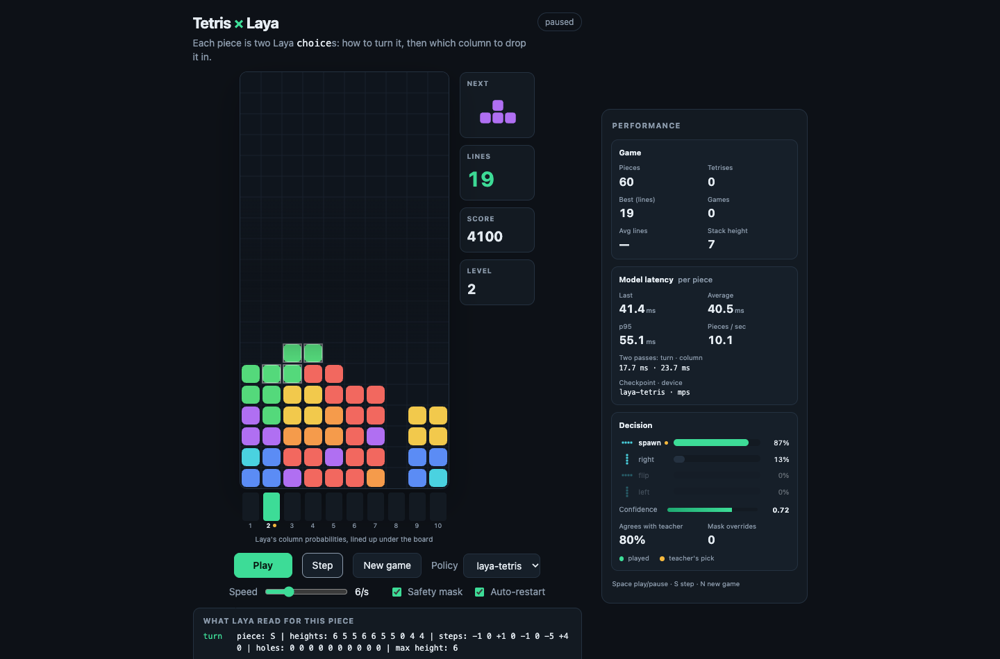

# Tetris × Laya

Tetris where every piece is placed by [Laya](https://huggingface.co/convaiinnovations/laya), a
non-autoregressive decision model. The model is a **fine-tuned copy** of `laya-multilingual`
(mmBERT-base, 322M), and each piece costs it two questions:

1. **how to turn the piece** — 4 options (chance: 25%)
2. **which column to drop it in** — 10 options, asked with the turn it just chose (chance: 10%)

No search, no lookahead, no generated text: the board becomes a line of features, and Laya returns a
probability for every option in one forward pass per question.

Fine-tuned weights: **[https://huggingface.co/rehman-ali/laya-tetris](https://huggingface.co/rehman-ali/laya-tetris)**

## Results

5 games, 8,000 pieces each, safety mask **off**, Apple M5 Pro GPU, seeds disjoint from training.

| policy | avg lines | best | topped out | agrees with teacher | latency p50 / p95 per piece |
|---|---|---|---|---|---|
| teacher (El-Tetris script, not a model) | 3198.2 | 3199 | never | 100% | 0.2 / 0.5 ms |
| **laya-tetris (fine-tuned)** | **3196.2** | **3199** | **never** | **79.5%** | 36.9 / 43.4 ms |
| laya-base (original, untuned) | 0.0 | 0 | after 25 pieces | 5.2% | 39.0 / 47.5 ms |
| random | 0.0 | 0 | after 26 pieces | 7.0% | – |

- **The safety mask never fired once** in 40,000 placements, so every line above is the model's own
  choice. The untuned model needs the mask on 44 of every 100 pieces.
- It disagrees with the teacher on about one piece in five and still loses 2 lines in 3,198: where it
  differs it has usually found an equally good placement, not a worse one.
- Neither the teacher nor the fine-tuned model has topped out yet at 8,000 pieces, so the ceiling of
  both is untested, not measured.

Validation accuracy, 6,000 held-out boards from games never trained on:

| question | options | chance | untuned | fine-tuned |
|---|---|---|---|---|
| turn | 4 | 25% | 33.3% | **84.5%** |
| column | 10 | 10% | 10.7% | **82.6%** |

One epoch over 163k boards, batch 32, 5,094 steps, about 110 minutes on an M5 Pro.



## Quick start

```bash
git clone https://github.com/RehmanaliMomin/TetrisGame_Laya && cd TetrisGame_Laya
pip install -r requirements.txt
hf download rehman-ali/laya-tetris --local-dir models/laya-tetris
python server.py            # open http://127.0.0.1:7871
```

The teacher and random policies need no download. To also compare against the untuned model:

```bash
hf download convaiinnovations/laya --include "multilingual/*" --local-dir models/_laya
mv models/_laya/multilingual models/laya-base && rm -rf models/_laya
```

## How it works

1. `tetris/game.py` holds the rules — a 10×20 bitboard, the 7-bag randomizer, hard drop and line
   clears. Dataset generation, training, the server and eval all import this one file, so they
   cannot drift apart.
2. `tetris/encode.py` turns the board into text Laya can read:

   ```
   piece: T | turn: flip | shape: width 3, underside 1 0 1 | heights: 4 4 3 3 5 6 6 4 2 2
     | steps: 0 -1 0 +2 +1 0 -2 -2 0 | holes: 0 0 1 0 0 0 0 0 0 0 | max height: 6
   ```

   `underside` is how an overhang becomes visible: a flipped T has undersides `1 0 1`, so it only
   sits flush where the middle column is one lower than its neighbours. Nothing in the text is the
   *result* of a placement — Laya never tries a move before picking it.
3. `tetris/teacher.py` is a script: it tries all ~34 placements and scores each with Dellacherie's
   six board features under the published El-Tetris weights. Its scores become soft training
   targets, and at play time the UI shows how often Laya agrees with it.
4. The safety mask (checkbox in the UI) swaps a column that would top the stack out for Laya's best
   surviving column, and counts the override.
5. The browser only draws: `server.py` runs the game and the model, `ui/` renders the board, the
   column-probability strip and the metrics panel.

## Pipeline

| Step | Command |
|---|---|
| 1 Tests (engine, teacher, encoder) | `python -m pytest` |
| 2 Baseline | `python eval/eval_headless.py --policy teacher,random,laya-base` |
| 3 Dataset (about 2 min, 163k rows) | `python training/make_dataset.py` |
| 4 Fine-tune | `python training/finetune.py --base models/laya-base --out models/laya-tetris` |
| 5 Eval | `python eval/eval_headless.py --games 10 --policy laya-tetris` |
| 6 Play | `python server.py` |
| 7 Optional DAgger round | `python training/make_dataset.py --rollout laya-tetris --out data/tetris_dagger`, then fine-tune again from `models/laya-tetris` |

### Fine-tuning

It runs on Apple Silicon (MPS), CUDA or CPU. The token embedding table — 197M of the 322M
parameters — is frozen by default, because Tetris text uses a few hundred of the 256k tokens;
`--train-embeddings` turns it back on.

On a free **Colab T4**: `sh training/pack_colab.sh` builds `data/tetris_colab.zip`, then open
`training/laya_tetris_colab.ipynb`, set the runtime to T4 GPU and run every cell. The last cell
downloads `laya-tetris.zip`; unzip it into `models/` so that `models/laya-tetris/model.safetensors`
exists, then restart `server.py`.

## Design notes

Longer write-up, including why the column question is the hard one: [`docs/design.md`](docs/design.md).

## Credits

Laya is by Convai Innovations, released under Apache 2.0. This project only fine-tunes a copy; the
fine-tuned weights keep that license. The teacher uses the
[El-Tetris](https://imake.ninja/el-tetris-an-improvement-on-pierre-dellacheries-algorithm/) weights
by Islam Ahmed, an improvement on Pierre Dellacherie's algorithm. Built after
[Snake × Laya](https://github.com/Okbatti/SnakeGame_Laya) by [@OwaisBatti](https://x.com/OwaisBatti).
